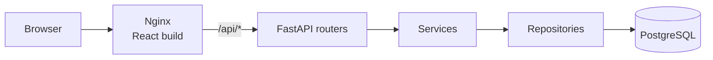

# Atelier: Online Clothing Store

Full-stack online clothing store: catalog, cart, favorites, checkout and an admin panel.

> **Context:** team project from my second year at RTU MIREA. A team of 5; I was the team lead and built the frontend. React, TypeScript, FastAPI, PostgreSQL. 2026. [Project presentation](https://z1ec.github.io/UNI-software-creation/)

<!-- Add a screenshot here:  -->

## Features

- Catalog with search, filters (category, gender, new arrivals) and pagination. The API also supports a price range.
- Product pages with an image gallery and sizes with stock.
- Cart, favorites and checkout. Prices are saved with each order, so later price changes do not alter past orders.
- Registration and login with JWT access and refresh tokens. Passwords are hashed with bcrypt.
- Admin panel behind a role check: manage products and categories, change user roles, update order status.

## Tech stack

| Layer | Technology |
| --- | --- |
| Frontend | React 19, TypeScript, Vite, Tailwind CSS 4, React Router 7 |
| Backend | Python, FastAPI, SQLAlchemy 2.0, Alembic, Pydantic, psycopg 3 |
| Auth | python-jose (JWT), passlib with bcrypt |
| Database | PostgreSQL 16 |
| Infrastructure | Docker Compose, Nginx |

## Architecture



- **Nginx** serves the React build and proxies `/api/` to the backend, so the frontend and the API share one origin.
- **The backend is layered:** routers handle HTTP and validation, services hold the business logic (cart, checkout, auth), repositories are the only layer that talks to the database.
- **Migrations:** on start the backend container applies Alembic migrations and seeds demo data, then launches the API.
- **Auth:** a short-lived access token (30 minutes) plus a refresh token (30 days). Admin routes check the role from the database.

## API overview

| Prefix | Purpose |
| --- | --- |
| `/api/auth` | register, login, refresh, logout, current user |
| `/api/products` | list with filters and pagination, details; create, update, delete for admins |
| `/api/categories` | list; create for admins |
| `/api/cart` | view, add, change quantity, remove, clear |
| `/api/favorites` | list, add, remove |
| `/api/orders` | order history, order details, checkout |
| `/api/users` | view and edit own profile |
| `/api/admin` | users and roles, all orders, order status |

Full interactive docs: http://localhost:8000/docs.

## Project structure

```text
backend/
  app/
    api/           routers
    services/      business logic
    repositories/  database access
    models/        SQLAlchemy models
    schemas/       Pydantic schemas
    core/          settings, JWT and password hashing
  alembic/         migrations
  seed.py          demo data
frontend/
  src/
    pages/         catalog, product, cart, favorites, profile, admin
    components/    layout, protected and admin routes, UI kit
    context/       auth and cart state
    api/           API client
docs/              presentation and screenshots
```

## Getting started

```bash
cp .env.example .env    # then change the passwords and JWT_SECRET_KEY
docker compose up -d --build
```

- Store: http://localhost
- API docs: http://localhost:8000/docs

## What I'd improve next

- Add pytest tests for checkout and cart logic.
- Decrease size stock at checkout and reject orders for sizes that are out of stock.
- Store prices as `Numeric` instead of `float` to avoid rounding errors.
